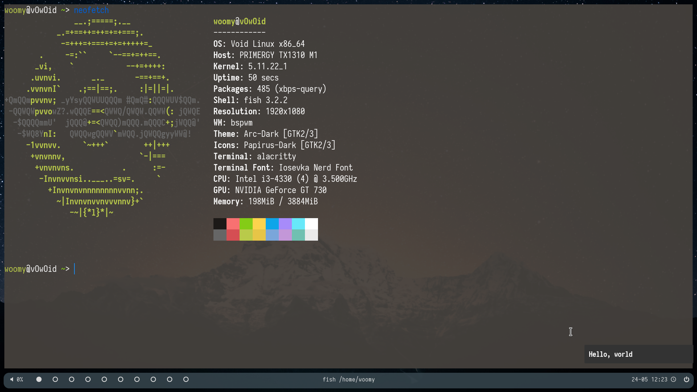

# Dotfiles-void-BSPWM

My dotfiles for void GNU/Linux + BSPWM

## Programs

- WM: BSPWM (+SXHKD for keyboard shortcuts)
- Terminal emulator: Alacritty
- Launcher: Rofi
- Editor: Neovim
- Bar: Polybar
- Notifications daemon: Dunst

## Screenshots

